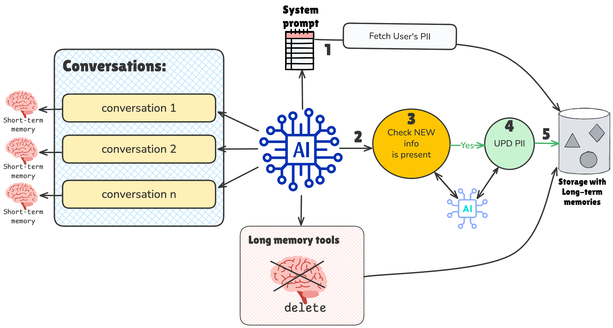
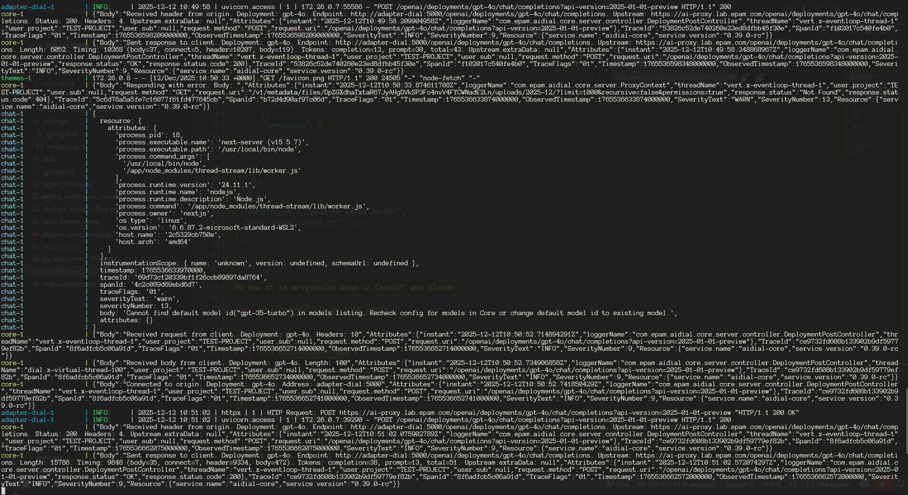

# GPA: Long-memory task


**Equipped with:**
- WEB Search (DuckDuckGo MCP Server. Performs WEB search and content fetching)
- Python Code Interpreter (MCP Server. A stateful Python code execution environment with Jupyter kernel support)
- Image Generation (ImageGen model within DIAL Core)
- File Content Extractor (Extract content from file (PDF, TXT, CSV). Supports basic pagination)
- RAG Search (Makes RAG search. Indexed files preserve during conversation in Cache)
- **Long-memory tools**:
  - Store memory
  - Search in memory
  - Delete long memory

## AFTER ALL THE TASKS DONE - DON'T FORGET TO REMOVE API KEYs FROM core/config.json

## Flow


---

## AFTER ALL THE TASKS DONE - DON'T FORGET TO REMOVE API KEYs FROM core/config.json

## Task overview
**We need to support Long-term memory for Agent**
- Agent should store important information about the User
- Agent should be able to access information about the User across all Conversations
- User should be able to delete long term memory on demand
- For storage use DIAL bucket (`appdata` folder)
- Support Deduplication process (once a day)
- Cache memories for the fast access

**⚠️ Pay attention that we will support super simplified version of Long-term memory 😅**


### Task
1. Run [docker-compose](docker-compose.yml)
2. Provide implementation for [memory_store_tool.py](task/tools/memory/memory_store_tool.py) according to TODO
3. Provide implementation for [memory_search_tool.py](task/tools/memory/memory_search_tool.py) according to TODO 
4. Provide implementation for [memory_delete_tool.py](task/tools/memory/memory_delete_tool.py) according to TODO
5. Provide implementation for [memory_store.py](task/tools/memory/memory_store.py) according to TODO
6. Add new tools to the [app.py](task/app.py)
7. **The most difficult part:** Create System prompt [prompts.py](task/prompts.py). The problem here is that we need to force Orchestration model to store and search memories. Don't hesitate to use LLMs to create system prompt (it won't work from the first try 😈)
8. Test it:
   - Firstly, need to save 5-10 memories about the User (e.g. name, living place, work place...)
   - Trigger search (indirectly) in new conversation, for instance if stored infor of place where you live, ask: `What should I wear now?` or `What is the weather?`. Expected behaviour: Model will retrieve info from Long memories and based on this context will make search about weather...
   - Trigger deletion. The long-term memory must be wiped out completely. Expected result: the `data.json` must be deleted with caches.


**Memories sample:**
```json

{
  "memories": [
    {
      "data": {
        "id": 1234,
        "content": "User prefers Python over JavaScript",
        "importance": 0.8,
        "category": "preferences",
        "topics": [
          "programming",
          "languages"
        ]
      },
      "embedding": [
        0.1,
        0.2,
        ...
      ]
    },
    {
      "data": {
        "id": 234455,
        "content": "Live in Paris",
        "importance": 0.9,
        "category": "live place",
        "topics": []
      },
      "embedding": [
        0.1,
        0.2,
        ...
      ]
    },
    ...
  ],
  "updated_at": "2025-10-14T10:30:00Z",
  "last_deduplicated_at": null
}
```

---

## How it is originally done in ChatGPT and Claude:


---


# Results

**If you’re working in WSL, don’t start your project from the `/mnt/c...` path, because it can cause read/write issues. Instead, clone the project into your HOME directory and run `docker compose` from there.**

## Logs
`docker compose down -v && docker compose up -d --build && docker compose logs -f`


## Chat
`http://localhost:3000/`


